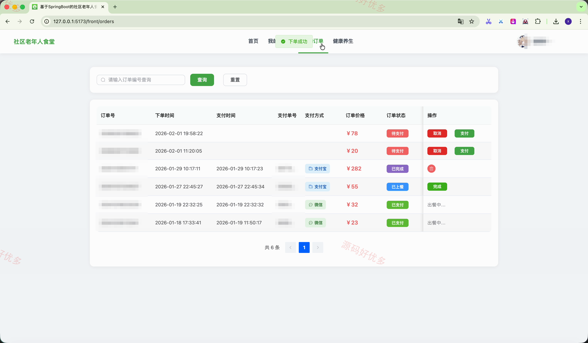
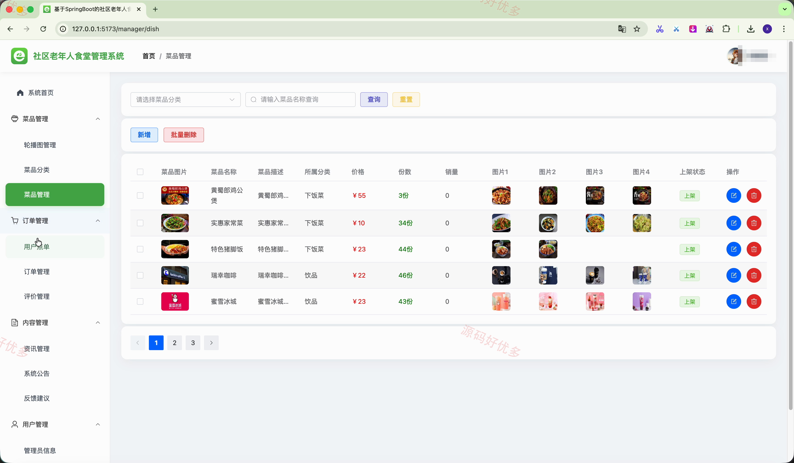
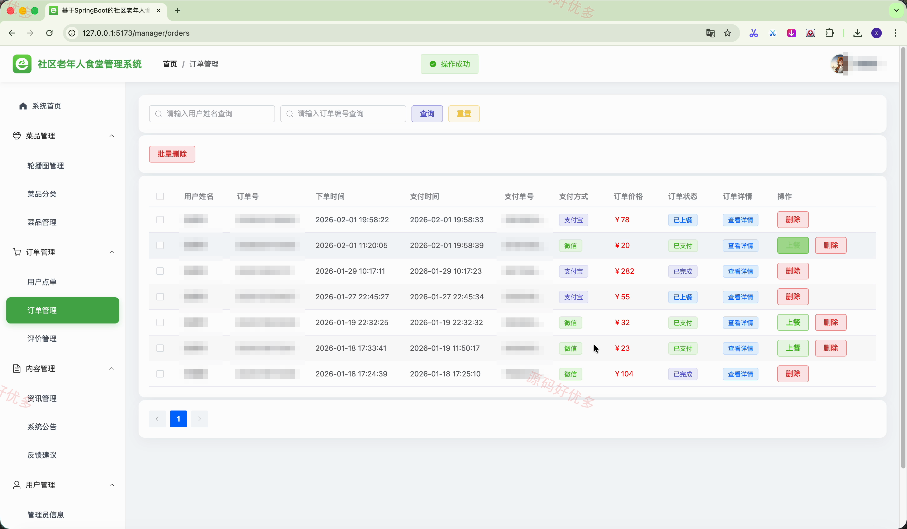
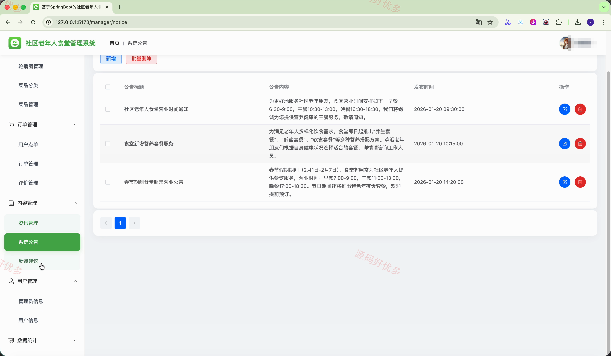
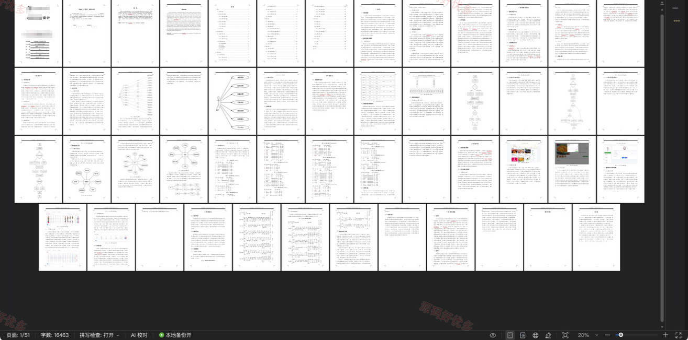

# springbootA649D-
springbootA649D 社区老年人食堂管理系统
## 源码问题查看主页咨询

### 一、关键词
社区老年食堂、老年助餐、菜品点单、就餐预约、食堂订单管理

### 二、作品包含
源码+数据库+万字设计文档+全套环境和工具资源+本地部署教程

### 三、项目技术
前端技术： Html、Css、Js、Vue3.4、Element-Plus
后端技术：Java、SpringBoot3.3.1、MyBatis

### 四、运行环境（以下版本亲测，其他版本兼容性请自行测试）
开发工具：IDEA/eclipse + VSCODE

数据库：MySQL5.7+（共16张表）

数据库管理工具：Navicat10以上版本

环境配置软件： JDK17 + Maven3.6.3

前端Nodejs：16+

浏览器：谷歌浏览器

### 五、项目介绍
项目编号：springbootA649D

社区老年人食堂管理系统面向社区老年人、普通用户和食堂管理员，提供菜品浏览、点单下单、在线支付、就餐预约、订单评价、资讯公告和意见反馈等服务；管理员可维护菜品与用户资料，确认就餐预约，处理点单、订单上餐和反馈回复，并管理食堂运营内容与互动记录。

角色：管理员、用户

管理员功能：管理员账户与用户账户管理、菜品分类及菜品轮播图管理、用户点单与订单上餐管理、就餐预约确认管理、订单评价管理、资讯公告与反馈回复管理、点赞收藏与浏览记录管理、个人资料与密码维护。

用户功能：注册登录与个人资料维护、菜品浏览搜索与详情查看、菜品点赞收藏与浏览记录、菜品点单下单与在线支付、订单详情取消完成与评价、就餐预约修改与取消、资讯公告浏览与反馈建议、余额充值与密码维护。

### 六、运行截图

